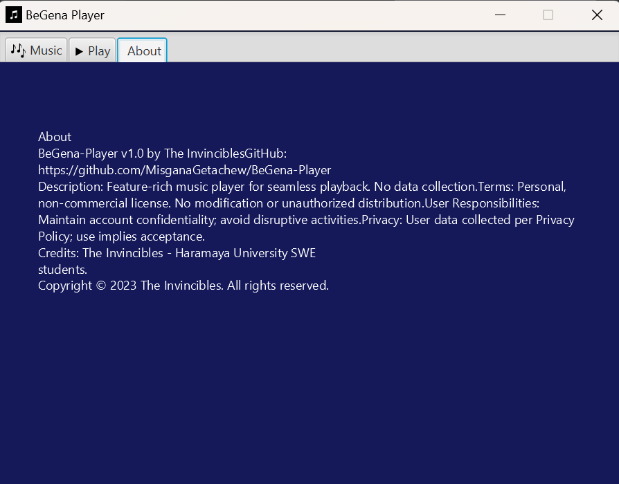
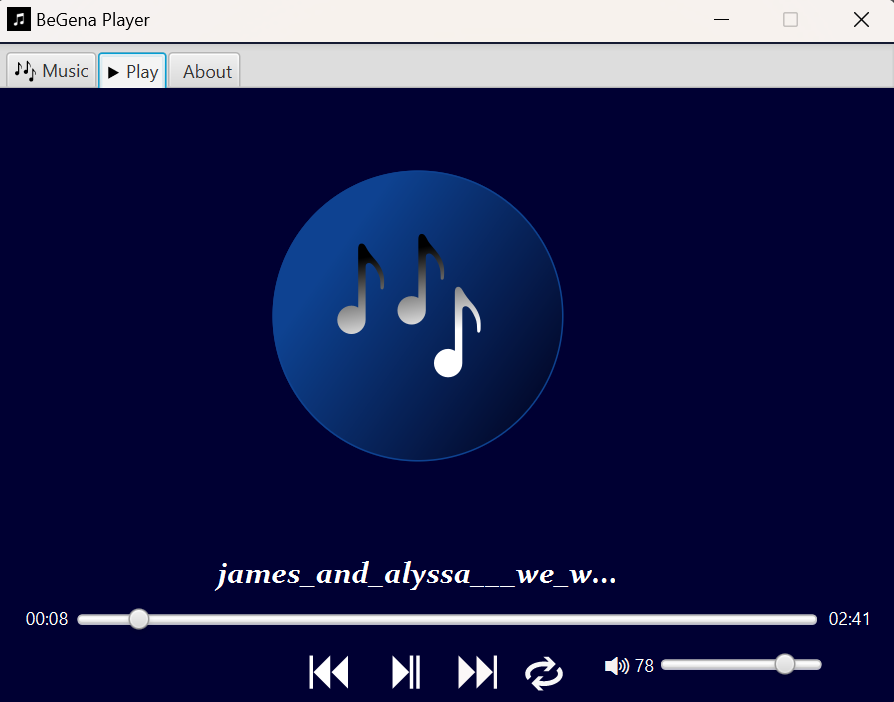

# BeGena-Player

BeGena Player is  a desktop Music player app named after the Amharic Music creating tool (በገና) read as "BeGena". 
This application offers a delightful and easy-to-use platform for playing, pausing,  and replaying
your favorite songs. With a user-friendly interface, you can also add new songs to your playlist,
search for specific tracks, and adjust the playback progress using sliders.

##### *Tools Used:*
Java programming Language,  
Javafx GUI,  
Junit testing library,  
File handling (for saving the path for the music file)  

### Installation
1. Clone the repository:  
   `git clone https://github.com/MisganaGetachew/BeGena-Player.git`  
2. Navigate to the project directory:  
   `cd BeGena-Player`

####overview

### Music

### Play

####  Developed by: The Invincibles

[Misgana Getachew](https://github.com/MisganaGetachew)  
[Samuel Negassa](https://github.com/Sami4N)  
[Oriemi Obang](https://github.com/oriemiobang)  
[Naol Lemessa](https://github.com/naol16)  
[Tesfatsion Gudeta ](https://github.com/Tesfatsion-Gudeta)  
[Hikma Jay ](https://github.com/Hikma2003)    
[Tirusew Mishamo](https://github.com/urim94)     

Conclusion:
Our Music Player Application leverages JavaFX and FXML to craft an intuitive interface, seamlessly facilitating the playback and management of songs. With core features like playback control, playlist management, and song addition, the application's functionality is robust. The code is structured into classes and components, each dedicated to specific aspects of the application. This organization not only ensures clarity but also provides customization and extension capabilities to meet unique requirements. Additionally, JUnit was employed to test the file-saving functionality, specifically validating the process of storing file paths as text.

### NB:  
after testing the APP make sure the 'music.txt' file is empty before running the app
